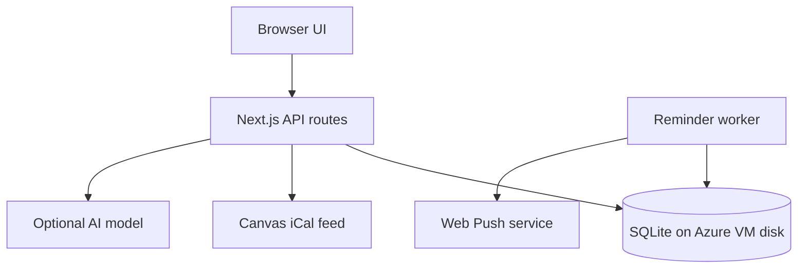

# Temple Study — weekend project scaffold

This repository is a **partial study app and team handoff**. Pilot authentication and manual Canvas calendar import are implemented; the other planned features still have route stubs and implementation notes. This project is not affiliated with Temple University.

## Goal and weekend boundary

Help a student see Canvas deadlines, work out the average needed on remaining coursework, choose one small study action, and receive a 48-hour and 24-hour browser push reminder for a timed assignment. Students provide their own syllabus grading weights and target; a calendar feed does not contain grades. The app should favor short focus sessions and low-friction next steps for students rebuilding study habits amid phone alerts, social media, avoidance, and task switching. Avoid shame-based language, unsupported claims of academic standing, and grade guarantees.

**Weekend MVP:** pilot account flow; manual Canvas iCal import; upcoming events; syllabus-input grade scenario; one AI or template study task; focus timer; per-device browser push; single-VM Azure demo. **Documented future options:** Google Calendar OAuth, Apple calendar subscription/export, SMS, recurring sync, and richer grading. Do not implement these expansions without the team's approval.

## Repository map and primary ownership

| Path | Purpose | Owner |
| --- | --- | --- |
| `app/page.tsx`, `app/layout.tsx`, `app/globals.css`, `components/Dashboard.tsx` | Student sign-in, Canvas import/refresh and event list; other dashboard features pending | 1 Frontend |
| `app/api/auth/`, `app/api/grades/`, `lib/auth/`, `lib/grades/`, `lib/db/` | Account/session, deterministic grade scenario, SQLite schema and migrations | 2 Backend |
| `app/api/canvas/`, `app/api/study/`, `lib/canvas/`, `lib/ai/` | iCal import, safe feed handling, one study task | 3 Canvas + AI |
| `app/api/push/`, `app/api/reminders/`, `lib/reminders/`, `worker/`, `infra/` | Push subscription, durable reminders, Azure deployment | 4 Reminders + deployment |
| `app/api/assignments/` | Shared event contract and local completion; owners 2 and 3 agree schema, owner 4 handles job cancellation | Shared |
| `tests/unit/`, `tests/integration/` | Each owner adds behavior tests for their slice | Shared |
| `docs/`, `.github/workflows/ci.yml`, `.env.example` | Contracts, provider notes, CI and secret names | Shared |



The browser and server are one Next.js TypeScript app to minimize setup. A separate Node worker reads the **same local SQLite file** and delivers Web Push. Use WAL mode and a persistent volume on **one host**; do not run SQLite over a shared network filesystem. Start with no Redis cache: the data is small and SQLite plus browser-side fetch state suffices. Introduce an in-process short TTL only if measured import/render latency requires it; invalidate it on a sync. Azure VM plus reverse proxy/HTTPS is the smallest deployment for the app and worker; see [deployment notes](docs/DEPLOYMENT.md).

## Local scaffold setup

1. Install Node.js 24 and npm. Run `npm ci`.
2. Run `npm run dev`; open `http://localhost:3000` and confirm the placeholder page appears.
3. Run `npm run typecheck` and `npm run build` before opening a PR. CI does both.
4. Copy `.env.example` to `.env.local` **when implementing the relevant feature**. Generate real keys privately; do not commit the file or any student's Canvas link.

Pilot registration/login, Canvas iCal import and manual refresh, and assignment listing are implemented. Grades, AI, worker, push, and SMS routes remain placeholders. Set a random 32-byte `APP_ENCRYPTION_KEY` (64 hex characters or base64) in `.env.local`; generate a key with `node -e "console.log(require('node:crypto').randomBytes(32).toString('hex'))"`. Keep this key stable: changing it makes stored feed URLs unreadable. Run `npm test` for synthetic-feed tests.

## Product behavior to implement

1. The student signs in and pastes their own Temple Canvas iCal URL. The server validates the exact Temple Canvas host, refuses redirects, limits response size/time, encrypts the secret URL, parses events, deduplicates by Canvas UID and recurrence ID, and handles timezone/date-only entries. A manual refresh updates changed deadlines and cancels obsolete reminders. **Never put the example personal URL in source, logs, fixtures, or issues.** Canvas calendar data does not prove an assignment is submitted.
2. The student enters a syllabus-based numeric pass target, earned weighted percentage points, and remaining weight. Return `(target − earned points) / (remaining weight / 100)` and label impossible (>100%), achieved (≤0%), and missing-weight cases. Temple's D− may pass generally, while General Education and some majors require C− or higher; the student must select their course's actual threshold. This is a scenario calculation, not a GPA or official standing assessment.
3. The student chooses one assignment, states a difficult topic and time available, and gets **one actionable short task** plus a focus timer. A model may tailor the task, but the grade computation stays deterministic. Use a server-side bounded request, an explicit model and token cap, no full feed or student identity in the prompt, a timeout, and a clearly labeled template fallback. Store usage for cost review.
4. The student grants Web Push permission per device. For a confirmed timed assignment, create idempotent reminder jobs at 48 and 24 hours before due time; skip already-passed offsets. The worker sends, retries briefly, records acceptance/errors, and cancels jobs when deadlines change or the student marks work complete. Never imply that provider acceptance guarantees a displayed notification. On supported iPhones, browser push requires adding the web app to the Home Screen.

## Four-person delivery plan

| Owner | Primary deliverable | Friday | Saturday | Sunday acceptance |
| --- | --- | --- | --- | --- |
| 1 Frontend | Responsive dashboard and focus flow | Agree API shapes, build page skeleton | Forms, states and accessibility | Demo from import to next study action |
| 2 Backend | SQLite, auth, grading | Schema, route contracts | Account and grade logic | Isolation and grade edge-case tests |
| 3 Canvas + AI | Safe feed import and study task | Obtain **synthetic** fixture, parser spike | Manual import, model/template boundary | Deduplication and prompt budget checks |
| 4 Reminders + Azure | Push worker and demo deployment | HTTPS/VM and subscription spike | Queue, worker, deploy | 24/48 scheduler tests and test push |

Each owner adds relevant tests and documents configuration. Friday agree `docs/API.md` and `lib/db/schema.sql` before parallel branches. Integrate by Saturday evening, rehearse Sunday. Use short PRs; owner 2 reviews changes to shared DB schema, owner 1 checks user-facing copy, owner 4 checks notification behavior. Do not block the demo on external OAuth approval, SMS sender setup, or platform-specific Apple APIs.

## Acceptance and honest demo

- Import a consenting test feed or synthetic fixture, refresh twice with no duplicate events, and show a changed due time rescheduling a job.
- Calculate a transparent needed grade from provided weights; state which threshold and syllabus were used.
- Generate one short task and show which mode produced it (model or template).
- Deliver an immediate **labeled test push** and use clock-controlled tests for 48/24-hour scheduling. Do not claim to have waited 48 hours during the demo.
- Sign in as a second student and verify no cross-user feed, event, study plan, or device access.

## Design documents

- [API and data contract](docs/API.md)
- [Canvas, Google, and Apple integration references](docs/integrations/README.md)
- [Grade logic](docs/GRADING.md)
- [AI and study habits](docs/AI_AND_HABITS.md)
- [Notifications](docs/NOTIFICATIONS.md)
- [Azure deployment and growth path](docs/DEPLOYMENT.md)

## GitHub handoff

This scaffold can be committed directly. In the extracted directory: `git init`, `git add .`, `git commit -m "Add Temple Study weekend scaffold"`, then create a GitHub repository and push according to GitHub's instructions. Verify `.env.local`, personal Canvas URLs, database files, and API keys are **absent** from `git status` before committing. There is no Git remote or GitHub repo configured here.
# Nemo.AI

Refactor of the original `temple-study-scaffold` (Next.js full-stack) into a
Python **FastAPI** backend and a **TypeScript** (Vite + React) frontend,
connected over REST + a WebSocket. The product scope is unchanged from the
original README — this is a structural/stack refactor, not a feature change,
except for the study-task route, which now streams from **Google Gemini**
token-by-token instead of being a stub.

```
nemo-ai/
  backend/     FastAPI app, SQLite, Canvas import, auth, Gemini WebSocket
  frontend/    Vite + React + TypeScript SPA
```

## What moved where

| Original | New |
| --- | --- |
| `app/api/auth/*` | `backend/app/routers/auth.py` |
| `app/api/canvas/import` | `backend/app/routers/canvas.py` + `backend/app/canvas_ics.py` |
| `app/api/grades/scenario` | `backend/app/routers/grades.py` |
| `app/api/assignments/*` | `backend/app/routers/assignments.py` |
| `app/api/study/plan` (stub) | `backend/app/routers/study.py` — now a **WebSocket** (`/ws/study-plan`) streaming from Gemini, see below |
| `lib/auth`, `lib/db`, `lib/canvas` | `backend/app/security.py`, `db.py`, `canvas_ics.py` |
| `components/Dashboard.tsx` | `frontend/src/components/Dashboard.tsx` (same behavior, calls the FastAPI backend) |
| — | `frontend/src/components/StudyPlan.tsx` — new UI for the Gemini feature |
| `app/api/push/*`, `app/api/reminders/*`, `lib/reminders`, `worker/` | **Not ported.** These were stubs/TODOs in the original (owner 4's slice) and stayed out of scope here. `backend/app/routers/push.py` and `reminders.py` keep the same `501 Not Implemented` stubs so the contract in `docs/API.md` still holds. |

Everything ported was tested end-to-end while building this (register →
login → session cookie → grade scenario → assignments list → origin
rejection; Canvas ICS parsing including recurrence expansion, all-day
events, and the cancelled/too-frequent guards; the WebSocket auth and
template-fallback path).

## Why a WebSocket for the study task

The original spec (`docs/AI_AND_HABITS.md`) called for one bounded AI
request per study session with a deterministic template fallback. That's
still true here — the WebSocket sends **one response per connection**, just
streamed token-by-token instead of returned as one JSON blob, so the student
sees the task appear as it's generated rather than waiting on a spinner.
Same constraints as before: small input (assignment title + difficult topic
+ minutes only, no name/email/full feed/grades), hard output-token cap,
timeout, and a labeled template fallback if the model is slow, errors, or
`GEMINI_API_KEY` isn't set.

## Running it locally

**Backend**
```bash
cd backend
python -m venv .venv && source .venv/bin/activate
pip install -r requirements.txt
cp .env.example .env   # fill in APP_ENCRYPTION_KEY at minimum
uvicorn app.main:app --reload --port 8000
```
Generate `APP_ENCRYPTION_KEY` with:
```bash
python -c "import secrets; print(secrets.token_hex(32))"
```

**Frontend**
```bash
cd frontend
npm install
cp .env.example .env.local   # defaults already point at localhost:8000
npm run dev
```
Open `http://localhost:5173`.

## Auth cookie across origins

The frontend and backend are now separate origins (ports 5173 and 8000), so
session cookies need `credentials: 'include'` on every request (already set
in `frontend/src/api/client.ts`) and CORS on the backend must name the exact
frontend origin — `ALLOWED_ORIGINS` in `backend/.env` (wildcard `*` won't
work with credentialed requests). In dev, `SameSite=Lax` is enough since
both are `localhost`. In production, if the frontend and backend are on
different domains, set `COOKIE_SECURE=true` so the backend switches to
`SameSite=None; Secure`, and serve both over HTTPS.

## Testing

- Backend: `cd backend && python -m pytest` (add tests under `backend/tests/`
  — none are included yet; the original repo's `tests/integration/canvas-import.test.ts`
  was TypeScript and wasn't ported).
- Frontend: `cd frontend && npm run typecheck && npm run build`.

## Not done here (carried over as TODOs from the original)

- Push notifications (`VAPID_*`, `/api/push/subscribe`)
- The 48/24-hour reminder scheduler and worker
- `PATCH /api/assignments/{id}` (needs the reminders piece to cancel jobs on completion)

These were unfinished in the original repo too (owner 4's slice) — porting
their *stub* status was the goal here, not implementing them.
