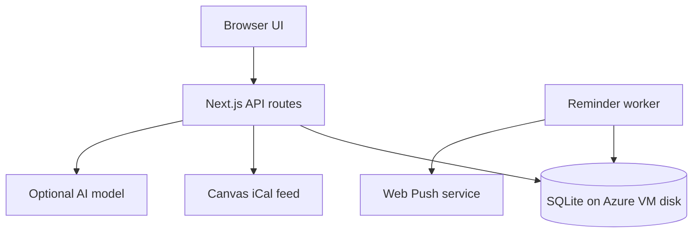

# Temple Study — weekend project scaffold

This repository is a **file structure and team handoff**, not a finished study app. It contains a runnable Next.js landing placeholder, route stubs that return HTTP 501, configuration templates, and implementation notes. The four owners can fill their files independently and integrate one demonstrable flow by Sunday. This project is not affiliated with Temple University.

## Goal and weekend boundary

Help a student see Canvas deadlines, work out the average needed on remaining coursework, choose one small study action, and receive a 48-hour and 24-hour browser push reminder for a timed assignment. Students provide their own syllabus grading weights and target; a calendar feed does not contain grades. The app should favor short focus sessions and low-friction next steps for students rebuilding study habits amid phone alerts, social media, avoidance, and task switching. Avoid shame-based language, unsupported claims of academic standing, and grade guarantees.

**Weekend MVP:** invite-only pilot account; manual Canvas iCal import; upcoming events; syllabus-input grade scenario; one AI or template study task; focus timer; per-device browser push; single-VM Azure demo. **Documented future options:** Google Calendar OAuth, Apple calendar subscription/export, SMS, recurring sync, and richer grading. Do not implement these expansions without the team's approval.

## Repository map and primary ownership

| Path | Purpose | Owner |
| --- | --- | --- |
| `app/page.tsx`, `app/layout.tsx`, `app/globals.css`, `components/Dashboard.tsx` | Mobile-first, accessible student UI; currently a placeholder | 1 Frontend |
| `app/api/auth/`, `app/api/grades/`, `lib/auth/`, `lib/grades/`, `lib/db/` | Account/session, deterministic grade scenario, SQLite schema and migrations | 2 Backend |
| `app/api/canvas/`, `app/api/study/`, `lib/canvas/`, `lib/ai/` | iCal import, safe feed handling, one study task | 3 Canvas + AI |
| `app/api/push/`, `app/api/reminders/`, `lib/reminders/`, `worker/`, `infra/` | Push subscription, durable reminders, Azure deployment | 4 Reminders + deployment |
| `app/api/assignments/` | Shared event contract and local completion; owners 2 and 3 agree schema, owner 4 handles job cancellation | Shared |
| `tests/unit/`, `tests/integration/` | Each owner adds behavior tests for their slice | Shared |
| `docs/`, `.github/workflows/ci.yml`, `.env.example` | Contracts, provider notes, CI and secret names | Shared |

The browser and server are one Next.js TypeScript app to minimize setup. A separate Node worker reads the **same local SQLite file** and delivers Web Push. Use WAL mode and a persistent volume on **one host**; do not run SQLite over a shared network filesystem. Start with no Redis cache: the data is small and SQLite plus browser-side fetch state suffices. Introduce an in-process short TTL only if measured import/render latency requires it; invalidate it on a sync. Azure VM plus reverse proxy/HTTPS is the smallest deployment for the app and worker; see [deployment notes](docs/DEPLOYMENT.md).

## Local scaffold setup

1. Install Node.js 24 and npm. Run `npm ci`.
2. Run `npm run dev`; open `http://localhost:3000` and confirm the placeholder page appears.
3. Run `npm run typecheck` and `npm run build` before opening a PR. CI does both.
4. Copy `.env.example` to `.env.local` **when implementing the relevant feature**. Generate real keys privately; do not commit the file or any student's Canvas link.

The scaffold has **no working login, import, grades, AI, worker, push, or SMS**. API route placeholders deliberately return 501. The dependencies for SQLite, iCal parsing, and Web Push should be added by the relevant owner with implementation and tests, rather than committing unused packages today.

## Product behavior to implement

1. The student signs in to an invite-only demo and pastes their own Temple Canvas iCal URL. The server validates the exact Temple Canvas host, refuses redirects, limits response size/time, encrypts the secret URL, parses events, deduplicates by Canvas UID and recurrence ID, and handles timezone/date-only entries. A manual refresh updates changed deadlines and cancels obsolete reminders. **Never put the example personal URL in source, logs, fixtures, or issues.** Canvas calendar data does not prove an assignment is submitted.
2. The student enters a syllabus-based numeric pass target, earned weighted percentage points, and remaining weight. Return `(target − earned points) / (remaining weight / 100)` and label impossible (>100%), achieved (≤0%), and missing-weight cases. Temple's D− may pass generally, while General Education and some majors require C− or higher; the student must select their course's actual threshold. This is a scenario calculation, not a GPA or official standing assessment.
3. The student chooses one assignment, states a difficult topic and time available, and gets **one actionable short task** plus a focus timer. A model may tailor the task, but the grade computation stays deterministic. Use a server-side bounded request, an explicit model and token cap, no full feed or student identity in the prompt, a timeout, and a clearly labeled template fallback. Store usage for cost review.
4. The student grants Web Push permission per device. For a confirmed timed assignment, create idempotent reminder jobs at 48 and 24 hours before due time; skip already-passed offsets. The worker sends, retries briefly, records acceptance/errors, and cancels jobs when deadlines change or the student marks work complete. Never imply that provider acceptance guarantees a displayed notification. On supported iPhones, browser push requires adding the web app to the Home Screen.

## Four-person delivery plan

| Owner | Primary deliverable | Friday | Saturday | Sunday acceptance |
| --- | --- | --- | --- | --- |
| 1 Frontend | Responsive dashboard and focus flow | Agree API shapes, build page skeleton | Forms, states and accessibility | Demo from import to next study action |
| 2 Backend | SQLite, auth, grading | Schema, route contracts, invite gate | Account and grade logic | Isolation and grade edge-case tests |
| 3 Canvas + AI | Safe feed import and study task | Obtain **synthetic** fixture, parser spike | Manual import, model/template boundary | Deduplication and prompt budget checks |
| 4 Reminders + Azure | Push worker and demo deployment | HTTPS/VM and subscription spike | Queue, worker, deploy | 24/48 scheduler tests and test push |

Each owner adds relevant tests and documents configuration. Friday agree `docs/API.md` and `lib/db/schema.sql` before parallel branches. Integrate by Saturday evening, rehearse Sunday. Use short PRs; owner 2 reviews changes to shared DB schema, owner 1 checks user-facing copy, owner 4 checks notification behavior. Do not block the demo on external OAuth approval, SMS sender setup, or platform-specific Apple APIs.

## Acceptance and honest demo

- Import a consenting test feed or synthetic fixture, refresh twice with no duplicate events, and show a changed due time rescheduling a job.
- Calculate a transparent needed grade from provided weights; state which threshold and syllabus were used.
- Generate one short task and show which mode produced it (model or template).
- Deliver an immediate **labeled test push** and use clock-controlled tests for 48/24-hour scheduling. Do not claim to have waited 48 hours during the demo.
- Sign in as a second student and verify no cross-user feed, event, study plan, or device access.

## Design documents

- [API and data contract](docs/API.md)
- [Canvas, Google, and Apple integration references](docs/integrations/README.md)
- [Grade logic](docs/GRADING.md)
- [AI and study habits](docs/AI_AND_HABITS.md)
- [Notifications](docs/NOTIFICATIONS.md)
- [Azure deployment and growth path](docs/DEPLOYMENT.md)

## GitHub handoff

This scaffold can be committed directly. In the extracted directory: `git init`, `git add .`, `git commit -m "Add Temple Study weekend scaffold"`, then create a GitHub repository and push according to GitHub's instructions. Verify `.env.local`, personal Canvas URLs, database files, and API keys are **absent** from `git status` before committing. There is no Git remote or GitHub repo configured here.
